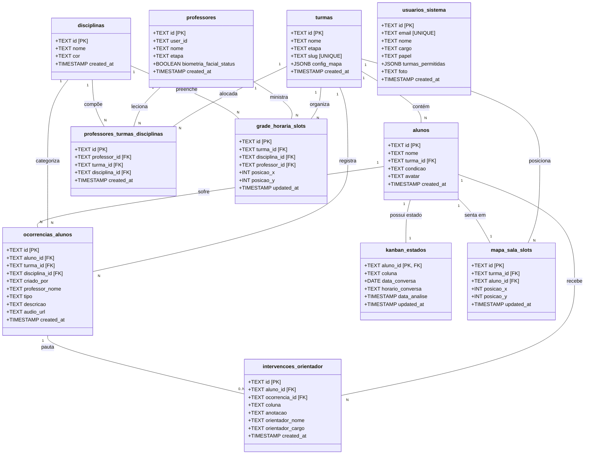
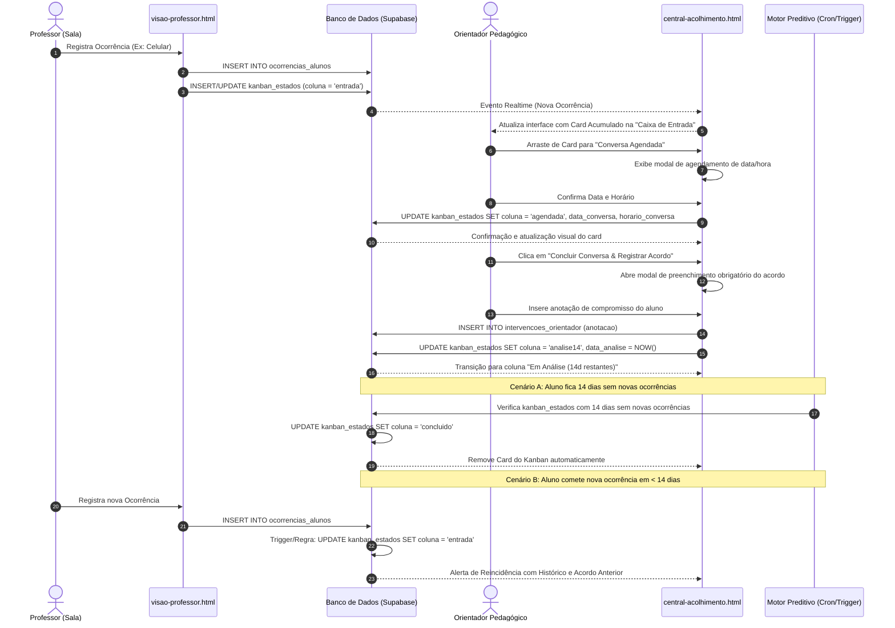

# Arquitetura, Segurança e Qualidade — Portal Rodin com IA v2.0

Este documento reúne a especificação técnica de arquitetura de dados, fluxos de integração, matriz de controle de acesso, estratégias de isolamento de tenants, práticas de qualidade de código e segurança de infraestrutura do **Portal Rodin**.

---

## 1. Mapa do Sistema (Diagramas UML)

### 1.1 Diagrama de Entidades e Relacionamentos (Classes)
O diagrama abaixo detalha a estrutura de dados relacional que sustenta o ecossistema do Portal Rodin no Supabase (PostgreSQL).



---

### 1.2 Diagrama de Sequência: Fluxo de Ocorrência & Kanban (14 Dias)
Este diagrama ilustra a troca de dados entre os componentes do sistema ao registrar, processar e resolver um comportamento em tempo real.



---

## 2. Tabela de Quem Pode o Quê (RBAC - Matriz de Acesso)

A tabela abaixo define os níveis de permissão lógica de cada cargo/papel nas telas e entidades do banco de dados do Portal Rodin:

| Tabela / Recurso | Diretor (Admin) | Orientador Pedagógico | Professor (Docente) | Monitor / Inspetor |
| :--- | :---: | :---: | :---: | :---: |
| **`usuarios_sistema`** | Leitura / Escrita | Nenhuma | Nenhuma | Nenhuma |
| **`turmas`** | Leitura / Escrita | Leitura | Leitura | Leitura |
| **`alunos`** | Leitura / Escrita | Leitura / Escrita | Leitura | Leitura |
| **`professores`** | Leitura / Escrita | Leitura | Leitura (Apenas o próprio) | Nenhuma |
| **`disciplinas`** | Leitura / Escrita | Leitura | Leitura | Nenhuma |
| **`ocorrencias_alunos`** | Leitura / Escrita | Leitura / Escrita | Leitura / Escrita (Apenas criadas por ele) | Leitura |
| **`intervencoes_orientador`** | Leitura / Escrita | Leitura / Escrita | Nenhuma | Nenhuma |
| **`kanban_estados`** | Leitura / Escrita | Leitura / Escrita | Nenhuma | Nenhuma |
| **`mapa_sala_slots`** | Leitura / Escrita | Leitura | Leitura / Escrita (Sua turma) | Leitura |
| **`grade_horaria_slots`** | Leitura / Escrita | Leitura | Leitura | Nenhuma |
| **Geração de PDF Diário** | Sim | Sim | Não | Não |
| **Autenticação Facial** | Isento | Isento | Obrigatório para acesso à Sala | Isento |

---

## 3. Separação de Clientes (Multi-tenancy)

Caso o **Portal Rodin** precise escalar para atender múltiplos campus, escolas do grupo ou unidades regionais do Colégio Rodin, a estratégia ideal de isolamento é o **Shared Database com Row-Level Isolation (Isolamento Lógico)**.

### 3.1 Chave de Isolamento (`tenant_id`)
Toda tabela do banco que contém dados sensíveis ou operacionais passa a contar obrigatoriamente com a coluna `tenant_id` (representando a escola/campus).

```sql
-- Exemplo de modelagem com suporte multi-unidade
ALTER TABLE public.turmas ADD COLUMN tenant_id TEXT NOT NULL DEFAULT 'rodin_indaiatuba';
ALTER TABLE public.alunos ADD COLUMN tenant_id TEXT NOT NULL DEFAULT 'rodin_indaiatuba';
ALTER TABLE public.ocorrencias_alunos ADD COLUMN tenant_id TEXT NOT NULL DEFAULT 'rodin_indaiatuba';
```

### 3.2 O que garante o isolamento?
1. **Filtro Automático na Conexão:** Ao realizar requisições ou queries, o backend lê a unidade autenticada do usuário (armazenada de forma segura na JWT do token de login) e aplica o filtro `WHERE tenant_id = current_tenant_id` implicitamente.
2. **Índices Compostos:** Para otimização de performance, criam-se índices agrupando a chave primária e a chave de tenant:
   ```sql
   CREATE INDEX idx_alunos_tenant ON public.alunos (tenant_id, id);
   CREATE INDEX idx_ocorrencias_tenant ON public.ocorrencias_alunos (tenant_id, turma_id);
   ```

---

## 4. Trava dentro do Banco (Row Level Security - RLS)

No Supabase/PostgreSQL, a interface web pode ser facilmente burlada se o banco de dados não possuir travas nativas. A ativação do **Row Level Security (RLS)** impede vazamentos e manipulações forçando o banco a rejeitar qualquer operação que não obedeça às políticas.

### 4.1 Ativando a trava
Para cada tabela operacional, ativa-se o RLS:
```sql
ALTER TABLE public.ocorrencias_alunos ENABLE ROW LEVEL SECURITY;
ALTER TABLE public.intervencoes_orientador ENABLE ROW LEVEL SECURITY;
```

### 4.2 Políticas Práticas (Exemplos de SQL)

#### Exemplo A: Professores só lêem/escrevem ocorrências criadas por eles ou de suas turmas alocadas
```sql
CREATE POLICY "Professores_Gerenciar_Proprias_Ocorrencias" ON public.ocorrencias_alunos
    FOR ALL
    TO authenticated
    USING (
        criado_por = auth.uid()::text 
        OR 
        turma_id IN (
            SELECT ptd.turma_id 
            FROM public.professores_turmas_disciplinas ptd
            JOIN public.professores p ON p.id = ptd.professor_id
            WHERE p.user_id = auth.uid()::text
        )
    )
    WITH CHECK (
        criado_por = auth.uid()::text
    );
```

#### Exemplo B: Orientadores têm controle completo apenas de ocorrências e Kanban
```sql
CREATE POLICY "Orientador_Controle_Total_Kanban" ON public.kanban_estados
    FOR ALL
    TO authenticated
    USING (
        EXISTS (
            SELECT 1 FROM public.usuarios_sistema
            WHERE id = auth.uid()::text AND papel = 'orientador'
        )
    );
```

---

## 5. Nenhuma Senha no Código (Secrets Management)

As credenciais do banco de dados, chaves de API secretas e tokens JWT **nunca** devem constar no código-fonte sob o risco de vazamentos catastróficos caso o repositório seja exposto.

### 5.1 Estrutura de Arquivo de Configuração (`.env`)
No ambiente de desenvolvimento e produção, utiliza-se variáveis de ambiente gerenciadas fora do Git.

```ini
# .env - CONFIGURAÇÃO LOCAL E PRODUÇÃO
PORT=3000
NODE_ENV=production

# Supabase Credentials (Seguras no backend)
SUPABASE_URL=https://vjnfkaenqrprtsiuqilb.supabase.co
SUPABASE_SERVICE_ROLE_KEY=eyJhbGciOiJIUzI1NiIsInR5cCI6IkpXVCJ9.ey... # CHAVE MASTER SECRETA (Nunca expor)

# Acesso público (Seguro de expor no client-side)
SUPABASE_ANON_KEY=eyJhbGciOiJIUzI1NiIsInR5cCI6IkpXVCJ9.ey...
```

### 5.2 Boas Práticas e Regras Implementadas
1. **Adicionado ao `.gitignore`:** O arquivo `.env` está explicitamente mapeado no `.gitignore` para evitar commits indevidos.
2. **Injeção Dinâmica via Node.js:** O arquivo `server.js` ou scripts associados carregam as chaves utilizando dependências de ambiente e expõem apenas a `SUPABASE_ANON_KEY` para o frontend através de requisições ou headers sanitizados, mantendo a `SERVICE_ROLE_KEY` isolada estritamente no ambiente do servidor backend.

---

## 6. Botão de Reportar Erro (Error Reporting & Log Capture)

Quando o sistema apresenta um erro em produção, o usuário comum raramente consegue explicar os detalhes técnicos. Para resolver isso, o Portal Rodin implementa um mecanismo de **Captura de Contexto Ativo** acessível por um botão global persistente.

### 6.1 Funcionamento do Botão Global
* **Visibilidade Incondicional:** O botão de reporte (`#btn-report-error`) fica flutuando no canto inferior direito de **todas** as telas, sempre visível (sem ocultação em menus).
* **Captura Automática de Tela (Print):** Ao ser clicado, o botão invoca a biblioteca `html2canvas` para renderizar a janela atual em uma imagem base64 sem necessitar de permissão extra do navegador.
* **Captura de Logs (Log Interceptor):** A aplicação escuta erros globais (`window.onerror`) e intercepta as chamadas de `console.error` para armazenar os últimos 50 logs de execução no estado local.
* **Fila de Erros (Queue System):** O payload contendo a imagem da tela, a pauta de erros técnicos (Stack Trace), metadados (User-Agent, URL activa, ID do usuário, tamanho da tela) é empacotado e enviado via POST para uma rota dedicada ou tabela de incidentes no Supabase (`ocorrencias_sistema_logs`), notificando a equipe de engenharia via webhook instantâneo.

```javascript
// Exemplo simplificado de interceptação e envio
window.addEventListener('error', (event) => {
    errorQueue.push({
        message: event.message,
        source: event.filename,
        line: event.lineno,
        col: event.colno,
        stack: event.error ? event.error.stack : null,
        timestamp: new Date().toISOString()
    });
});
```

---

## 7. Testes Automáticos (Unitários, Integração e E2E)

Para garantir que novas modificações não quebrem funcionalidades já homologadas, o Portal Rodin adota uma pirâmide de testes estruturada.

### 7.1 Divisão dos Testes
1. **Testes Unitários (Jest):** Validam funções puras da aplicação, como cálculos da contagem regressiva dos 14 dias do Kanban, sanitização de dados recebidos no backend e conversão de horários.
2. **Testes de Integração (Supertest + Supabase Mock):** Validam a comunicação entre as rotas do servidor HTTP (`server.js`) e as regras lógicas de banco, simulando cadastros e salvamentos sem impactar o banco de dados de produção.
3. **Testes E2E (Playwright / Cypress):** Automatizam robôs que simulam a jornada real do usuário.
   * **Fluxo de Sala:** O robô acessa `/visao-professor/6-ano-a`, passa pelo login de biometria facial, interage com o mapa de carteiras e lança um desvio de conduta.
   * **Fluxo de Central:** O robô entra na `/central-acolhimento.html`, verifica se o card do aluno apareceu na "Caixa de Entrada", arrasta para "Conversa Agendada", preenche o formulário e arrasta para "Em Análise".

### 7.2 Integração Contínua (CI/CD Gate)
Toda alteração de código enviada ao repositório central aciona um workflow automatizado no GitHub Actions. Os testes são executados e, **caso qualquer um falhe, o pull request é travado e o deploy é imediatamente bloqueado**.

---

## 8. Auditoria de Segurança (Security Audit)

A auditoria de segurança atua como o **Gate Final de Deploy**, verificando brechas e vulnerabilidades estáticas no código e pacotes antes da publicação oficial.

### 8.1 Verificações do Gate de Deploy
* **Análise de Dependências (`npm audit` / Snyk):** Varre a árvore do `package.json` à procura de pacotes com vulnerabilidades conhecidas (CVEs). Se houver alguma falha crítica ou de alta severidade, o build é abortado.
* **Varredura Estática de Código (SAST - Semgrep):** Procura por padrões perigosos no código Javascript (como injeção de SQL, uso de `eval`, exposição acidental de tokens e falta de sanitização de caminhos de arquivos em requisições de arquivos).
* **Validação de Permissões RLS:** Scripts rodando antes de subir as migrations validam se todas as novas tabelas possuem `ALTER TABLE ENABLE ROW LEVEL SECURITY` e políticas de segurança declaradas.

---

## 9. Escudo na Frente do Site (WAF, Bot Fight Mode & Rate Limiting)

Para proteger o Portal Rodin de ataques de negação de serviço (DDoS), força bruta e varreduras automatizadas de bots, a aplicação é encapsulada em uma camada de proteção perimetral na CDN (Edge Network).

```
👉 Usuário ──> [ WAF / Rate Limiting (Cloudflare) ] ──> [ Servidor HTTP (Node.js) ] ──> [ Banco (Supabase) ]
```

### 9.1 Mecanismos de Proteção
1. **Web Application Firewall (WAF):** Analisa o tráfego HTTP em tempo real e bloqueia requisições maliciosas conhecidas (ataques de SQL Injection, Cross-Site Scripting (XSS) e tentativas de Directory Traversal).
2. **Bot Fight Mode:** Desafia requisições suspeitas originadas de data centers ou scripts automatizados (como Puppeteer não-homologados) por meio de JavaScript Challenges silenciosos, impedindo que robôs vasculhem o site em busca de vulnerabilidades.
3. **Rate Limiting por IP:** Define um teto máximo de requisições por segundo por IP (ex: máximo de 10 chamadas/segundo para o endpoint de autenticação biométrica facial). Se o limite for excedido, o IP é bloqueado temporariamente por 15 minutos, mitigando ataques de força bruta.

---

## 10. HTTPS e Cadeado Verde (TLS/SSL + HSTS - Full Strict)

Para blindar o tráfego de dados sensíveis dos alunos e professores (como imagens da biometria facial, áudios e prontuários comportamentais), a criptografia em trânsito é obrigatória e configurada no nível máximo.

### 10.1 Criptografia de Ponta a Ponta (SSL/TLS)
* **TLS v1.3 Mínimo:** O tráfego de dados é encriptado usando a versão mais recente e segura do protocolo TLS (1.3), desabilitando algoritmos antigos vulneráveis (como SSLv3, TLS 1.0 e TLS 1.1).
* **Certificados Let's Encrypt:** Automação total de renovação de certificados SSL com validação DNS via CDN.

### 10.2 Strict-Transport-Security (HSTS)
O servidor Node.js ou o proxy de borda injeta obrigatoriamente o cabeçalho HSTS nas requisições:
```http
Strict-Transport-Security: max-age=63072000; includeSubDomains; preload
```
* **O que isso faz?** Força o navegador do usuário a se comunicar com o domínio `sala.colegiorodin.tech` **exclusivamente via HTTPS** por até dois anos (`max-age`). O parâmetro `preload` insere o domínio na lista global de pré-carregamento HTTPS dos principais navegadores, impedindo que ataques de Man-in-the-Middle (como SSL Strip) redirecionem a conexão do usuário para versões HTTP não criptografadas.
